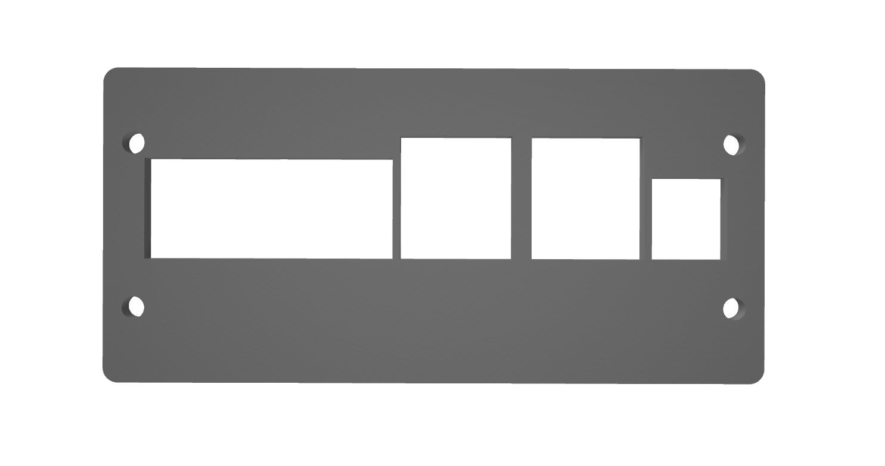
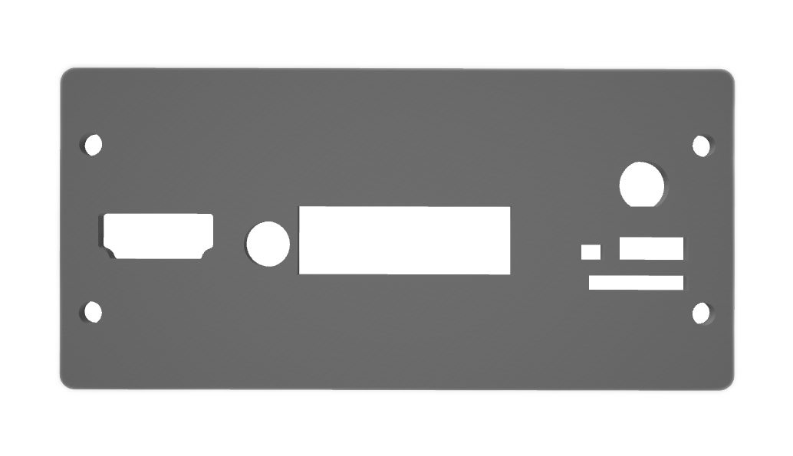
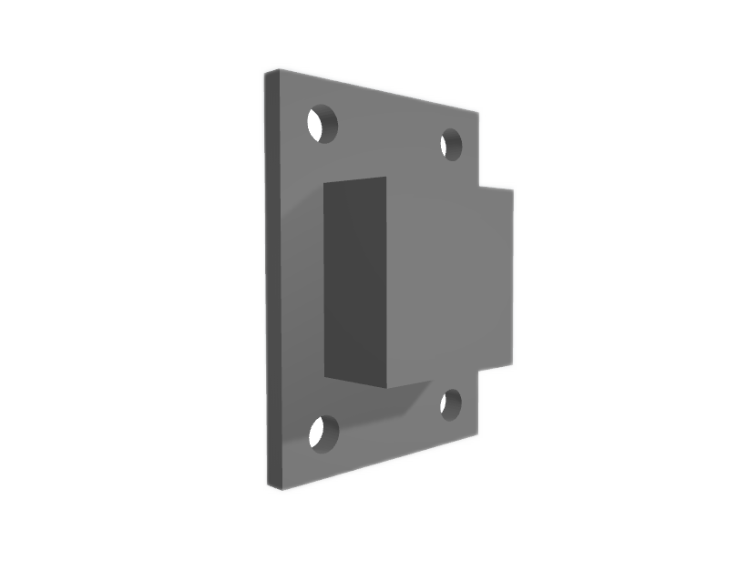

# Fanless case for sipeed LPI4A board  

Big thanks to [Alexandra](https://t.me/AlexandraUstyuzhaninova) for their help with the 3D models!


## Model full view
<p float="left">
    
    
</p>

# Aluminum parts for milling 
|Image|Name|Quantity|Comments|
|---|---|---|---|
| |[LPI4A_FRONT_x1.STL](./STL/LPI4A_FRONT_x1.STL)|x1||
| |[LPI4A_BACK_x1.STL](./STL/LPI4A_BACK_x1.STL)|x1||
| |[LPI4A_CPU_x1.STL](./STL/LPI4A_CPU_x1.STL)|x1||
| |[LPI4A_SIDE_x2.STL](./STL/LPI4A_SIDE_x2.STL)|x2||
| |[LPI4A_UPDOWN_x2.STL](./STL/LPI4A_UPDOWN_x2.STL)|x2|You can leave only the top cover.|

# Hardware
|Image|Name|Quantity|Comments|
|---|---|---|---|
||[M3 5mm stainless steel thumb screws](https://aliexpress.ru/item/1005003319197693.html?spm=a2g2w.orderdetail.0.0.67d24aa68a02Ft&sku_id=12000028684114331)|x8|Мounting front and back panels|
||[M3 5mm Stainless steel cross phillips round head](https://aliexpress.ru/item/1005004090390208.html?spm=a2g2w.detail.similar_rcmd.7.56cf26c8AlAUUY&mixer_rcmd_bucket_id=aerabtestalgoRecommendAbV25_controlRu1&pdp_trigger_item_id=0_1005002496382349&ru_algo_pv_id=2807e7-61b690-8423cd-560721-1718103600&scenario=aerSimilarItemPdpRcmd&sku_id=12000027997880531&traffic_source=recommendation&type_rcmd=core)|x4|Mounting the adapter between the top cover and the processor|


# Miscellaneous
|Image|Name|Quantity|Comments|
|---|---|---|---|
||[Thermal pad 2.0mm thickness](https://aliexpress.ru/item/1005003020892456.html?spm=a2g2w.orderdetail.0.0.178a4aa6qbgcXl&sku_id=12000029332866957)|x1|Installed between adapter and processor|


## Images of a near-final prototype
<p float="left">
    
    
</p>

## CPU heat dissipation testing
```console
openssl speed -multi $(grep -ci processor /proc/cpuinfo)
```


